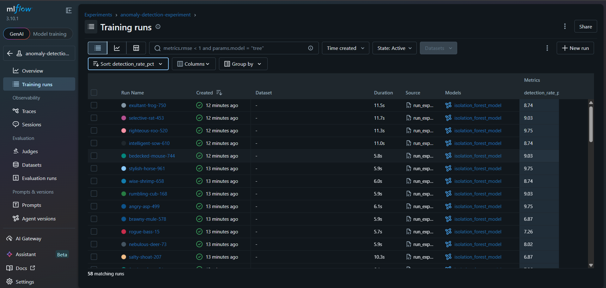
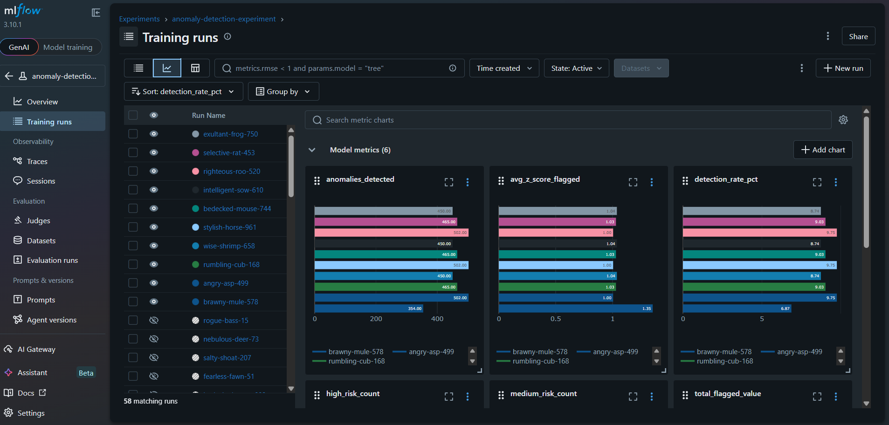
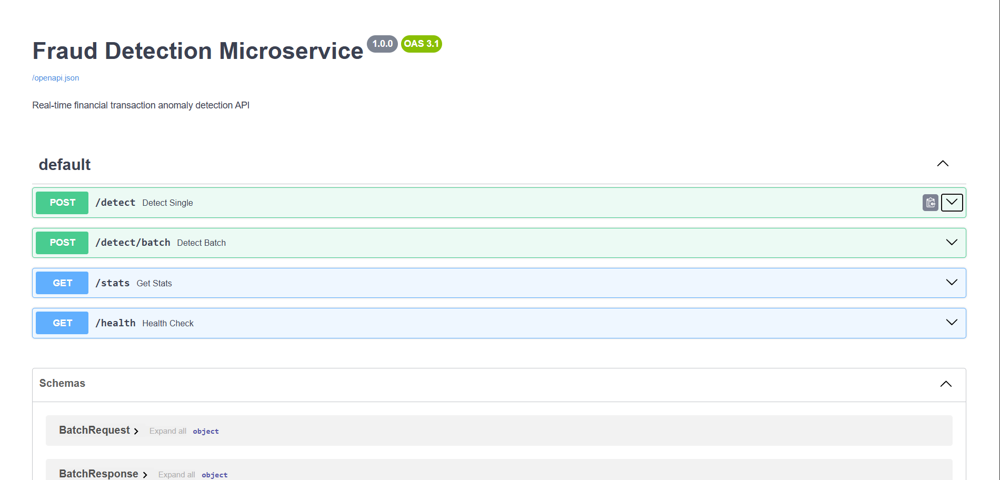
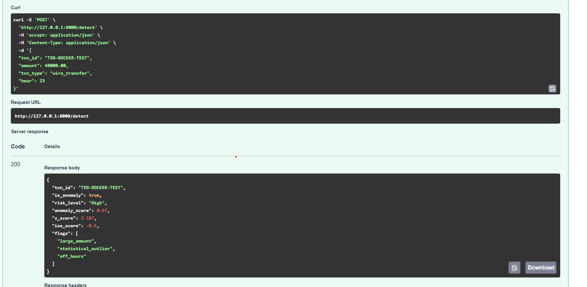

# Financial Anomaly Detection Dashboard

A production-style financial transaction monitoring system that detects 
suspicious activity using three statistical and machine learning algorithms, 
visualized through an interactive real-time dashboard.

**[Live Demo](https://financial-anomaly-detector-kdwrqnaah73fgv5pq37f3t.streamlit.app/)** | **[GitHub](https://github.com/jennjoyce6/financial-anomaly-detector)**

---

## What it does

Ingests financial transaction data, runs three anomaly detection algorithms 
in parallel, and surfaces flagged transactions with risk scores through an 
interactive Streamlit dashboard — enabling analysts to tune detection 
sensitivity in real time.

---

## Tech stack

| Layer | Technology |
|---|---|
| Dashboard | Streamlit, Plotly |
| Detection models | Scikit-learn (Isolation Forest), NumPy |
| Data layer | SQLite, SQLAlchemy, Pandas |
| Testing | Pytest |
| Language | Python 3.11 |

---

## Detection algorithms

Three algorithms run in parallel on every transaction. A transaction is 
flagged when two or more algorithms agree (consensus scoring):

**1. Z-score detection**
Flags transactions where the amount deviates more than N standard deviations 
from the mean. Fast and interpretable — good for normally distributed data.

**2. IQR method**
Flags transactions outside Q1 - 1.5×IQR and Q3 + 1.5×IQR bounds. More 
robust than Z-score for skewed financial distributions.

**3. Isolation Forest (ML)**
Catches multi-dimensional anomalies — a medium-sized transaction at 3am is 
suspicious even if the amount alone looks normal. Uses amount, hour, 
weekend flag, and off-hours flag as features.

---

## Architecture
```
financial-anomaly-detector/
├── app.py                  ← Streamlit dashboard (entry point)
├── data/
│   └── generate_data.py    ← Synthetic transaction generator (SQLite)
├── models/
│   └── anomaly_detector.py ← Z-score, IQR, Isolation Forest
├── tests/
│   └── test_detector.py    ← Pytest unit tests
└── requirements.txt
```

## MLflow experiment tracking

All model configurations are tracked via MLflow for full reproducibility.
45 parameter combinations were evaluated across three variables:

| Parameter | Values tested |
|---|---|
| `contamination` | 0.03, 0.04, 0.05, 0.06, 0.08 |
| `z_threshold` | 2.5, 3.0, 3.5 |
| `iqr_multiplier` | 1.2, 1.5, 1.8 |

**Best run:** 502 anomalies detected at 9.7% detection rate.

### All 45 experiment runs



### Detection rate across all runs



### Running experiments locally
```bash
# Run all 45 experiment combinations
python mlflow_experiments/run_experiments.py

# Open MLflow UI to compare runs
mlflow ui
# → http://127.0.0.1:5000
```

---

## Fraud detection microservice

A containerized REST API wrapping the anomaly detection logic — any system 
can call it programmatically without touching the dashboard.

### Endpoints

| Method | Endpoint | Description |
|---|---|---|
| GET | `/health` | Service health check |
| POST | `/detect` | Analyze a single transaction |
| POST | `/detect/batch` | Analyze up to 1,000 transactions |
| GET | `/stats` | Session detection statistics |

### API docs



### Sample response



### Running the microservice
```bash
# Build the Docker image
docker build -t fraud-detection-api .

# Run with Docker Compose
docker compose up

# API available at http://127.0.0.1:8000
# Interactive docs at http://127.0.0.1:8000/docs
```

### Example request
```bash
curl -X POST http://127.0.0.1:8000/detect \
  -H "Content-Type: application/json" \
  -d '{
    "txn_id":   "TXN-88421",
    "amount":   48000.00,
    "txn_type": "wire_transfer",
    "hour":     23
  }'
```

### Example response
```json
{
  "txn_id":        "TXN-88421",
  "is_anomaly":    true,
  "risk_level":    "High",
  "anomaly_score": 1.0,
  "z_score":       4.21,
  "iso_score":     -0.18,
  "flags": ["large_amount", "statistical_outlier", "off_hours"]
}
```

## Running locally
```bash
# 1. Clone the repo
git clone https://github.com/jennjoyce6/financial-anomaly-detector
cd financial-anomaly-detector

# 2. Create and activate virtual environment
python -m venv venv
source venv/bin/activate        # Mac/Linux
venv\Scripts\activate           # Windows

# 3. Install dependencies
pip install -r requirements.txt

# 4. Generate transaction data
python data/generate_data.py

# 5. Run the dashboard
streamlit run app.py
```

---

## Running tests
```bash
pytest tests/ -v
```

---

## Key results

- **5,150 transactions** processed across 5 transaction types
- **374 anomalies detected** at 7.3% detection rate
- **Three risk tiers** — High, Medium, Low with confidence scoring
- **Adjustable thresholds** — Z-score and IQR sensitivity tunable in real time
- **Full unit test coverage** via pytest

---

## Anomaly patterns detected

The synthetic dataset includes three injected anomaly patterns that mirror 
real-world financial fraud signals:

- **Large amount outliers** — wire transfers significantly above normal range
- **Off-hours activity** — transactions between midnight and 5am
- **Structuring patterns** — amounts just below common reporting thresholds 
  ($9,999, $4,999) — a known financial fraud technique

---

## If I were to extend this

- Connect to a live transaction stream via Kafka or AWS Kinesis
- Add email/Slack alerting when High-risk transactions are detected
- Replace synthetic data with anonymized public datasets (e.g. PaySim)
- Add a model retraining pipeline with MLflow experiment tracking
- Build a REST API wrapper so other services can query the detector